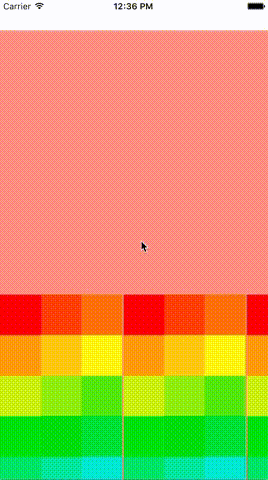

# PaperKit
PaperKit is like Paper app of Facebook. Paper is super cool user interface. PaperKit is a library that can be reproduced easily Paper of the user interface.



### Try Sample

```bash
$ pod try PaperKit
```

### Quick start

PaperKit is available on [CocoaPods](http://cocoapods.org).  Add the following to your Podfile:

```ruby
pod 'PaperKit'
```

Import the framework header, or create an [Objective-C bridging
header](https://developer.apple.com/library/ios/documentation/swift/conceptual/buildingcocoaapps/MixandMatch.html)
if you're using Swift:

```objective-c
#import <PaperKit/PaperKit.h>
```

Inherit the PKViewController

```objective-c
@interface ViewController : PKViewController
```

### Usage
#### PKViewController

The PKViewController there are multiple CollectionView.
To control the respective CollectionViewController, override the following method.

```objective-c
- (NSInteger)backgroundCollectionView:(UICollectionView *)collectionView numberOfItemsInSection:(NSInteger)section
{
    // override method
    return 10;
}

- (NSInteger)foregroundCollectionVew:(UICollectionView *)collectionView numberOfItemsInSection:(NSInteger)section onCategory:(NSInteger)category
{
    // override method
    return 10;
}
```

```objective-c
- (UICollectionViewCell *)backgroundCollectionView:(UICollectionView *)collectionView cellForItemAtIndexPath:(NSIndexPath *)indexPath
{
    UICollectionViewCell *cell = [collectionView dequeueReusableCellWithReuseIdentifier:@"Cell" forIndexPath:indexPath];
    CGFloat color = floorf(indexPath.item)/[self backgroundCollectionView:collectionView numberOfItemsInSection:indexPath.section];
    cell.backgroundColor = [UIColor colorWithHue:color saturation:1 brightness:1 alpha:1];
    return cell;
}

- (PKContentViewController *)foregroundCollectionView:(PKCollectionView *)collectionView contentViewControllerForAtIndexPath:(NSIndexPath *)indexPath onCategory:(NSUInteger)category
{
    NSLog(@"indexPaht %@ cateogry %lu",indexPath, (unsigned long)category);
    return [ContentViewController new];
}
```

#### PKWindow

PKWindow can be hierarchically arranged the Window.
PKWindow is managed by PKWindowManager.

```objective-c
- (BOOL)application:(UIApplication *)application didFinishLaunchingWithOptions:(NSDictionary *)launchOptions {
    
    self.window = [[UIWindow alloc] initWithFrame:[UIScreen mainScreen].bounds];
    BackgroundViewController *backgroundViewController = [BackgroundViewController new];
    self.window.rootViewController = backgroundViewController;
    [self.window makeKeyAndVisible];
    
    [PKWindowManager managerWithBaseWindow:self.window];
        
    return YES;
}

```

Create a new Window by passing the RootViewController to PKWindowManger.

```objective-c
ViewController *nextViewController = [ViewController new];
[[PKWindowManager sharedManager] showWindowWithRootViewController:nextViewController];

```


### Learn more

* Read the [Design Details: Paper by Facebook](http://blog.brianlovin.com/design-details-paper-by-facebook/)
* [AsyncDisplayKit](https://github.com/facebook/AsyncDisplayKit)
